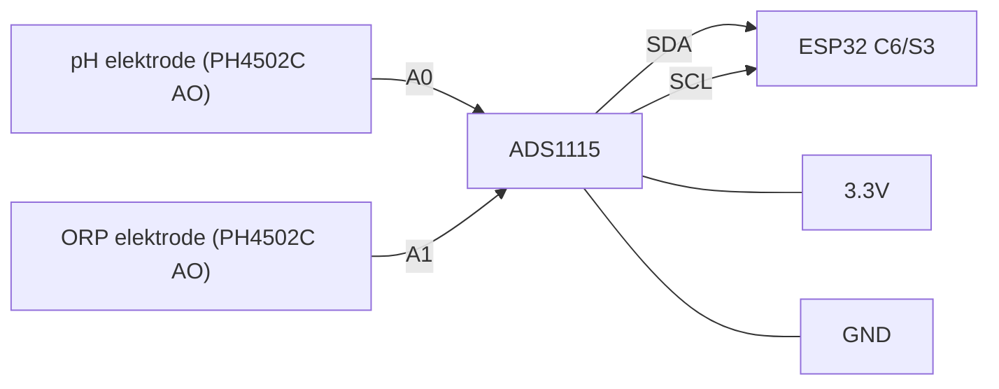
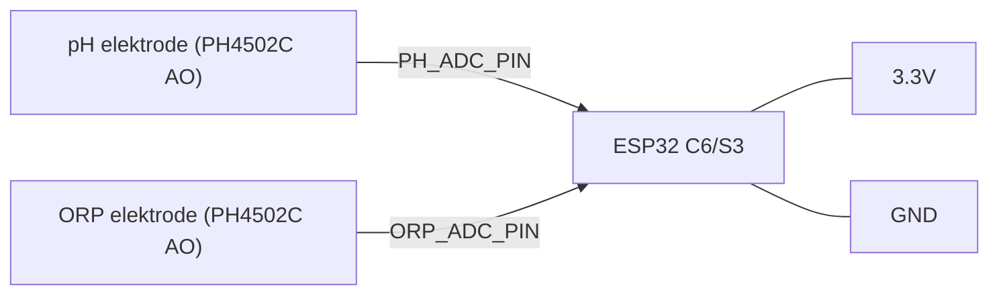

## PoolLab — ESP32‑C6 Touch LCD pool monitor (Tuya sniffer, Zigbee/WiFi, MQTT)

### Wat het doet
- **Tuya sniffer**: leest de UART tussen je host‑MCU en Tuya CB3S, parseert `0x55 0xAA` frames en toont de laatste waarden op het 1.47" LCD en via USB‑serial.
- **Twee modi**: schakel tussen **Zigbee** en **WiFi/MQTT** via een UI‑toggle. De keuze wordt **persistent opgeslagen** (NVS) en bij boot toegepast.
- **MQTT integratie**: publiceert pH/ORP/temperatuur en biedt Home Assistant auto‑discovery + command topics om drempels te wijzigen.
- **Zigbee commissioning**: lange druk op BOOT (>3s) start commissioning; WiFi wordt tijdelijk uitgezet; na afloop wordt je vorige modus hersteld.

### Hardware/Board
- Getest op Waveshare **ESP32‑C6‑Touch‑LCD‑1.47**. LCD wordt als ST7789 aangestuurd met Arduino_GFX, 172x320 en kolom‑offset 34.
- De pinmapping voor het display staat in `src/main.cpp` (Arduino_GFX bus en ST7789 constructie). Pas deze aan als je een andere revisie hebt.

### Sniff‑bekabeling (alleen lezen)
- **GND ↔ GND**
- MCU → CB3S RXD1 (pin 15) → ESP32‑C6 `RX_A` (GPIO 4)
- CB3S TXD1 (pin 16) → MCU → ESP32‑C6 `RX_B` (GPIO 5) (optioneel)
- Verbind ESP32 TX niet wanneer je alleen wilt sniffen.

### Motor driver (SparkFun ROB‑14450 / TB6612FNG)
- Voeding en massa:
  - **VCC** ↔ ESP32 3V3 (logica‑voeding 3.3 V)
  - **GND** ↔ GND (gemeenschappelijke massa met ESP32 en motorspanning verplicht)
  - **VM** ↔ motorspanning (bijv. 6–12 V, afhankelijk van pomp‑motoren)
- Besturingspinnen naar ESP32‑C6 (zoals ingesteld in `src/main.cpp`):
  - **STBY** ↔ GPIO 3 (`TB_STBY`)
  - **AIN1** ↔ GPIO 7 (`M1_IN1`)
  - **AIN2** ↔ GPIO 8 (`M1_IN2`)
  - **PWMA** ↔ GPIO 5 (`M1_PWM`)
  - **BIN1** ↔ GPIO 4 (`M2_IN1`)
  - **BIN2** ↔ GPIO 6 (`M2_IN2`)
  - **PWMB** ↔ GPIO 9 (`M2_PWM`)
- Motoruitgangen:
  - **A01/A02** ↔ Motor 1 (pH‑pomp)
  - **B01/B02** ↔ Motor 2 (ORP‑pomp)

Notities
- Standaard PWM is 10 kHz (8‑bit). Snelheden per motor zijn instelbaar in de UI en worden opgeslagen in NVS.
- `GPIO 9` is een BOOT‑pin op veel C6‑boards. In de broncode staat `MOTOR_ENABLE = false` om boot‑conflicten te vermijden. Wil je de motorsturing inschakelen, zet `MOTOR_ENABLE` op `true` en overweeg `M2_PWM` naar een andere vrije PWM‑capabele GPIO te verplaatsen als je problemen ziet met booten.
- **STBY** moet hoog zijn om de driver te activeren; in deze setup wordt dit door de ESP32 via `TB_STBY` geregeld.

### Bouwen en flashen
- Open de map in PlatformIO (VS Code).
- Gebruik het environment `esp32-c6-devkitc-1` (zie `platformio.ini`).
- Seriële monitor: 115200 baud.
- CLI (optioneel):
  - Build: `pio run -e esp32-c6-devkitc-1`
  - Upload: `pio run -t upload -e esp32-c6-devkitc-1`

### Configuratie (WiFi/MQTT)
- WiFi via captive portal (aanbevolen):
  - Bij lege WiFi‑gegevens of na meerdere mislukte connect‑pogingen start automatisch een AP `PoolLab-Setup`.
  - Verbind met dat AP en open een willekeurige URL; het formulier “WiFi setup” verschijnt. Vul SSID/wachtwoord in en kies Save & Reboot.
  - De gegevens worden in NVS opgeslagen en bij boot gebruikt. Handmatig starten kan via Settings → Network → Configure WiFi.
- MQTT in `src/main.cpp` (handmatig aanpassen indien nodig):
  - `MQTT_HOST`, `MQTT_PORT`, `MQTT_USER`, `MQTT_PASS`, `MQTT_CLIENTID`

### OTA (Over‑the‑Air updates)
- OTA wordt automatisch geactiveerd nadat het device een IP heeft gekregen.
- Hostnaam: `poollab-XXXXXX` (laatste 3 bytes van chip‑ID). Upload via PlatformIO “Upload using network” of een OTA‑tool compatible met ArduinoOTA.

### Modi en persistentie
- De UI‑schakelaar roept `storage.setMode(...)` aan en schakelt direct radios:
  - Zigbee: WiFi wordt uitgezet (`WIFI_OFF`). Als je al gebonden was, wordt de Zigbee‑stack gestart.
  - WiFi/MQTT: WiFi STA wordt aangezet en MQTT gestart.
- Bij boot wordt de opgeslagen modus eerst uit NVS geladen, daarna pas WiFi/Zigbee gestart. Je keuze blijft dus behouden over reboots.
- Tijdens Zigbee‑commissioning (lange druk op BOOT) wordt de modemodus tijdelijk geforceerd naar Zigbee. Na afloop wordt je vorige modus hersteld en weggeschreven.

### MQTT
- Topics (states):
  - `pool/sensor/ph`
  - `pool/sensor/orp`
  - `pool/sensor/temp`
- Home Assistant discovery topics:
  - `homeassistant/sensor/pool_ph/config`
  - `homeassistant/sensor/pool_orp/config`
  - `homeassistant/sensor/pool_temp/config`
- Command/config topics (schrijven om drempels te zetten, config echo’t terug):
  - `pool/cmd/ph_min`  ↔ `pool/cfg/ph_min`
  - `pool/cmd/ph_max`  ↔ `pool/cfg/ph_max`
  - `pool/cmd/orp_min` ↔ `pool/cfg/orp_min`
  - `pool/cmd/orp_max` ↔ `pool/cfg/orp_max`

#### Belangrijke recente wijzigingen
- Unieke clientId per device op basis van chip‑ID (geen ID‑conflict meer bij meerdere devices).
- Exponential backoff bij mislukte connect (start 5 s → max 5 min); voorkomt UI‑stalls.
- Eenmalige, duidelijke MQTT‑log bij boot: toont host/poort/user/pass‑lengte en eerste connect‑uitkomst.
- WebUI Settings bevat nu ook MQTT‑velden (host/port/user/pass). Opslaan → NVS + directe reconnect.
- Lege poort betekent: bewaar poort `0` en laat het device geen port‑suffix aan host toevoegen (intern gebruiken we 1883 als default TCP, tenzij je TLS/streams configureert; zie hieronder).

### WebUI (via WiFi)
- Home: tegels in donkere LVGL‑stijl met live updates (WebSocket) voor pH, ORP en Temp.
- Settings: Mode (Zigbee/WiFi), pH min/max, ORP min/max, motor‑snelheden; opslaan → NVS + directe applicatie.
- URLs:
  - `http://<ip>/`
  - `http://<ip>/settings`
  - WebSocket op poort 81 (client wordt automatisch geopend door de homepage).

#### WebUI → MQTT instellingen
- Host, Port (mag leeg), User, Password kun je nu in de browser instellen.
- Opslaan triggert directe reconnect zonder reboot.
- Diagnose: zet tijdelijk MQTT‑debug aan in code of check de boot‑log (éénmalige probe).

### LVGL UI (C6 en S3)
- ESP32‑C6: compacte LVGL‑UI met TileView (pH/ORP), grijze achtergrond; eigen builder.
- ESP32‑S3 (3.5") : 3‑card UI (pH/ORP/Temp) met moderne tegels.
- Legacy (Adafruit_GFX) UI is verwijderd (bestanden weggehaald).
- Touch fixes: geen key‑repeat, debouncing in touch driver (geen dubbele toetsaanslagen).
- Watchdogs:
  - C6: herbouwt UI als `lv_timer_handler()` >5 s geen activiteit heeft. Logt: `LVGL watchdog: rebuild complete (C6)`.
  - S3: heartbeat vanuit LVGL‑task/BSP‑timer; herbouwt UI als heartbeat >8 s stilstaat. Logt: `S3 LVGL watchdog: rebuild complete`.

### Cloudflare + Nginx Proxy Manager (NPM) voor MQTT
MQTT is raw TCP. HTTP “Proxy Hosts” werken niet voor MQTT‑TCP. Gebruik Streams of WebSockets.

1) Streams (TCP) zonder TLS (snelste, eenvoudig):
- Cloudflare DNS record: zet op “DNS only” (grijze wolk). CF proxy (oranje) werkt niet voor raw TCP.
- NPM → Streams → Add Stream:
  - Incoming Port: `1883`
  - Forward Host/IP: interne MQTT‑broker (bijv. `192.168.x.y`)
  - Forward Port: `1883`
  - Protocol: `TCP`
- Router/NAT: forward extern `1883` → NPM‑host:1883.
- Device: host = jouw domein, port = 1883.

2) Streams (TCP) met TLS (8883), zodat 1883 niet open hoeft:
- Optie A (TLS offload in NPM):
  - NPM → SSL Certificates → Let’s Encrypt voor `mqtt.yourdomain.tld`.
  - Streams: Listen `8883` (TCP) → Forward `1883` (TCP) + koppel SSL‑cert.
  - Device: TLS‑client vereist (WiFiClientSecure). (Firmware‑TODO als je dit wilt gebruiken.)
- Optie B (TLS passthrough):
  - Broker luistert zelf op `8883` met geldig cert.
  - NPM Streams: Listen `8883` → Forward `8883` (geen SSL in NPM).
  - Device: TLS‑client vereist + juiste CA.

3) WebSockets via HTTP Proxy Host (alleen als je WS‑MQTT client gebruikt):
- Broker moet `protocol websockets` listener hebben (bijv. `9001`).
- NPM → Proxy Hosts → domein → Forward naar `9001`, “Websockets” aanvinken, LE‑cert.
- Let op: de gebruikte embedded MQTT‑client (PubSubClient) ondersteunt geen WS; dit is primair voor browser/desktop MQTT‑clients.

### Troubleshooting
- WiFi “NO_AP_FOUND”: controleer SSID/ontvangst. De code probeert auto‑reconnect en periodieke hard restarts.
- MQTT extern werkt niet, lokaal wel:
  - Cloudflare DNS moet “DNS only” zijn voor TCP‑streams.
  - NPM: gebruik Streams (TCP), geen Proxy Host.
  - Broker‑auth/ACL: zorg dat de gebruiker bestaat en rechten heeft (HA Mosquitto: ACL in `/share/mosquitto/acl.conf`).
  - Test extern met `mosquitto_sub/pub` (met user/pass) voordat je het device test.
- UI bevriest na lange uptime: check of de watchdog een rebuild logt. Zo niet, open een issue met serielog.

### Dependencies (zie `platformio.ini`)
- `GFX Library for Arduino` (moononournation / Arduino_GFX)
- `PubSubClient`
- `lvgl`
- (Zigbee libs indien gecompileerd)

### Changelog (samengevat)
- Verwijderd: Legacy C6 GFX UI en Adafruit_GFX dependency.
- Toegevoegd: C6 LVGL tileview hersteld; S3 3‑card UI.
- Touch debouncing en keyboard repeat uit.
- WebUI: MQTT‑instellingen + directe herlaad (`requestMqttReload`).
- MQTT: unieke clientId, exponential backoff, éénmalige boot‑probe.
- Watchdogs voor C6 en S3 met console‑log bij rebuild.
- Reset WiFi knop: leegt NVS en reboot direct (captieve portal start schoon op).

### Projectstructuur (belangrijkste componenten)
- `src/main.cpp`: Orkestratie. UI‑handlers, bootvolgorde, WiFi/MQTT, Zigbee‑commissioning, Tuya‑feed, periodieke publish.
- `src/core/Storage.{h,cpp}`: Dunne wrapper rond `Preferences` (NVS). Slaat drempels, motorsnelheden en modemodus op (`poolcfg` namespace).
- `src/core/DisplayBridge.{h,cpp}`: Brug tussen Arduino_GFX en LVGL (display registratie, thema, input).
- `src/boards/BoardSelect.h`: Boardprofielen en capabilities (`BOARD`, `HAS_ZIGBEE`) en displayconfig.
- `src/domain/Metrics.{h,cpp}`: Houdt laatste pH/ORP/temperatuur bij; bron voor UI/MQTT.
- `src/io/MqttClient.{h,cpp}`: PubSubClient‑gebaseerde client; discovery, state‑publish, command‑topics → NVS.
- `src/io/Tuya.{h,cpp}`: Configuratie en parsing van Tuya‑frames; voedt `Metrics`.
- `src/io/ZigbeeClient.{h,cpp}`: Abstractie voor Arduino Zigbee (indien beschikbaar); commissioning‑venster e.d.
- `src/ui/UI.{h,cpp}`: Eenvoudige LVGL UI met toggles/sliders; handlers configureerbaar vanuit `main.cpp`.
- `src/fonts`, `src/images`: UI assets.

### pH / ORP sensoren

Je kunt de sensoren op twee manieren uitlezen:

1) Interne ESP32‑ADC
- Zet in `platformio.ini` per environment:
```
-D USE_ANALOG_SENSORS=1
-D PH_ADC_PIN=<adc_gpio>
-D ORP_ADC_PIN=<adc_gpio>
```
- pH/ORP AO → respectievelijk `PH_ADC_PIN` / `ORP_ADC_PIN` (3.3 V max), GND gemeenschappelijk.
  - C6 advies: `PH_ADC_PIN=0`, `ORP_ADC_PIN=7`
  - S3 advies: `PH_ADC_PIN=1`, `ORP_ADC_PIN=2`

2) ADS1115 (16‑bit) via I2C
- Zet in `platformio.ini` per environment:
```
-D USE_ADS1115=1
-D ADS_ADDR=0x48        ; 0x48..0x4B afhankelijk van ADDR
-D ADS_SDA=18           ; I2C SDA (voorbeeld)
-D ADS_SCL=19           ; I2C SCL (voorbeeld)
-D ADS_CH_PH=0          ; single‑ended kanaal 0
-D ADS_CH_ORP=1         ; single‑ended kanaal 1
```
- Bekabeling: pH AO → A0, ORP AO → A1, SDA/SCL → ESP32, VDD=3.3 V (aanbevolen na OPA2333‑mod), GND gemeenschappelijk. I2C‑pull‑ups naar 3.3 V.
  - C6/S3 advies: `ADS_SDA=18`, `ADS_SCL=19`, `ADS_CH_PH=0`, `ADS_CH_ORP=1`, `ADS_ADDR=0x48`

Calibratie
- Via UI: Settings → Calibration → pH / ORP of via de speed‑dial rechtsonder.
- pH: meet buffer 4.00 en 10.00 (opslaan). ORP: 0 mV solution (Sample) en eventueel mV/V aanpassen.
- Waarden worden in NVS opgeslagen en automatisch geladen bij boot (werkt voor zowel ADC als ADS).

### Wiring diagrams

Optie A — ADS1115 (aanbevolen)



- ESP32‑C6: SDA=GPIO18, SCL=GPIO19, A0=pH, A1=ORP, VDD=3.3V, GND common
- ESP32‑S3: idem (pas desgewenst SDA/SCL aan en zet flags)
- Flags per env:
  - `-D USE_ADS1115=1`
  - `-D ADS_ADDR=0x48`
  - `-D ADS_SDA=18`
  - `-D ADS_SCL=19`
  - `-D ADS_CH_PH=0`
  - `-D ADS_CH_ORP=1`

Optie B — Interne ADC (ESP32)



- ESP32‑C6: `PH_ADC_PIN=0`, `ORP_ADC_PIN=7`
- ESP32‑S3: `PH_ADC_PIN=1`, `ORP_ADC_PIN=2`
- Flags per env:
  - `-D USE_ANALOG_SENSORS=1`
  - `-D PH_ADC_PIN=<pin>`
  - `-D ORP_ADC_PIN=<pin>`

Algemeen
- Deel GND tussen sensoren, ADS1115 en ESP32.
- I2C‑pull‑ups naar 3.3 V (niet 5 V).
- Met OPA2333 op 3.3 V zijn spanningsdelers niet nodig; AO blijft binnen 0..3.3 V.
