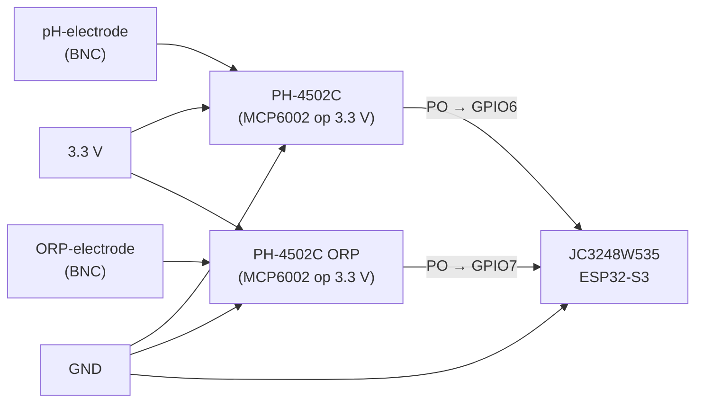
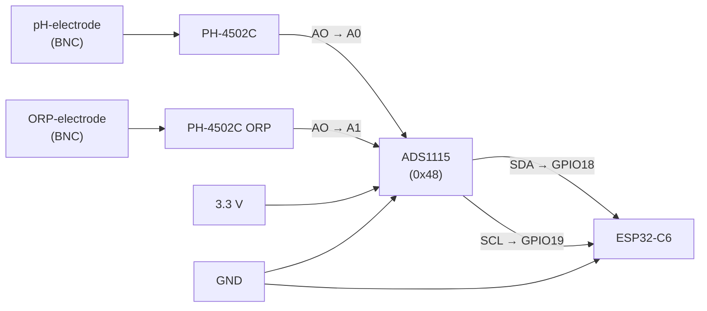
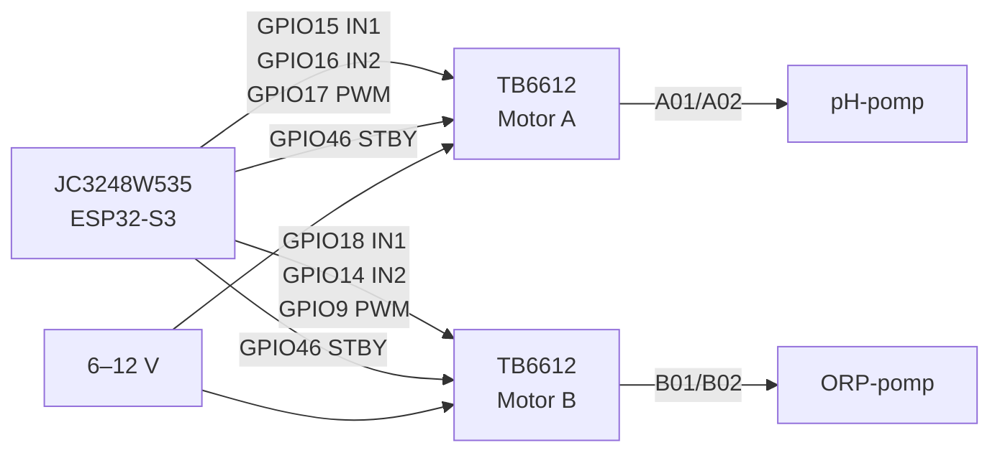

## PoolLab — ESP32‑S3 zwembadmonitor (pH, ORP, Temp · LVGL · MQTT · Zigbee)

### Wat het doet
- **pH en ORP meten** via analoge PH‑4502C/ORP‑4502C sensorbordjes (MCP6002 op 3.3 V) rechtstreeks op de ESP32 ADC.
- **Twee modi**: schakel tussen **Zigbee** en **WiFi/MQTT** via een UI‑toggle. De keuze wordt persistent opgeslagen (NVS) en bij boot toegepast.
- **MQTT integratie**: publiceert pH/ORP/temperatuur en biedt Home Assistant auto‑discovery + command topics om drempels te wijzigen.
- **Doseer‑pompen**: twee peristaltische pompen (pH/ORP) via TB6612FNG driver, met PWM‑snelheidsregeling vanuit de LVGL‑UI.
- **Safety**: limieten voor dagvolume, sessieduur en pH/ORP sanity; automatische noodstop + WhatsApp‑notificatie.
- **Zigbee commissioning**: lange druk op BOOT (>3 s) start commissioning; WiFi wordt tijdelijk uitgezet.

---

### Primaire hardware

| Onderdeel | Omschrijving |
|-----------|-------------|
| **MCU** | JC3248W535 — ESP32‑S3, 3.5" IPS 320×480 QSPI display, capacitief touch |
| **Sensoren** | 2× PH‑4502C bordje (één voor pH, één voor ORP), LM358 vervangen door **MCP6002** |
| **Motor driver** | SparkFun ROB‑14450 / TB6612FNG |
| **Pompen** | 2× peristaltische pomp (pH‑dosering en ORP/chloor‑dosering) |

---

### Sensor bekabeling (PH‑4502C met MCP6002 op 3.3 V)

> **Belangrijk:** Voed het bordje op **3.3 V**, niet 5 V.
> De MCP6002 is rail‑to‑rail (1.8–6 V). Bij 5 V kan de analoge output bij zuur water boven 3.3 V uitkomen en de ESP32 ADC beschadigen.

```
PH‑4502C (pH bordje)        JC3248W535 (ESP32‑S3)
  VCC  ──────────────────────  3.3 V
  GND  ──────────────────────  GND
  PO   ──────────────────────  GPIO6   (ADC1_CH5)
  DO   niet aansluiten
  TO   niet aansluiten
  BNC  ←── pH‑electrode

PH‑4502C (ORP bordje)       JC3248W535 (ESP32‑S3)
  VCC  ──────────────────────  3.3 V
  GND  ──────────────────────  GND
  PO   ──────────────────────  GPIO7   (ADC1_CH6)
  DO   niet aansluiten
  TO   niet aansluiten
  BNC  ←── ORP‑electrode
```

GPIO6 en GPIO7 zijn vrije ADC1‑pinnen (geen WiFi‑conflict). De overige ADC1‑pinnen zijn in gebruik door QSPI‑display (21/39/40/45/47/48), touch I2C (4/8), motoren (9/14–18) en I2S‑speaker (2/41/42).

**Testen zonder probe:**
Verbind de BNC center pin met de BNC outer ring via een 10 kΩ weerstand → simuleert 0 mV (pH 7 / 0 mV ORP) → de display toont ~pH 7.0 en ~0 mV.

**Platformio.ini flags (al ingesteld voor `esp32‑s3‑35`):**
```ini
-D USE_ANALOG_SENSORS=1
-D PH_ADC_PIN=6
-D ORP_ADC_PIN=7
```

**Kalibratie defaults (MCP6002 op 3.3 V, gain ≈ 5.2×):**
| Punt | Spanning |
|------|---------|
| pH 4 | ≈ 2.58 V |
| pH 7 | ≈ 1.65 V (mid‑supply) |
| pH 10 | ≈ 0.72 V |
| ORP 0 mV | ≈ 1.65 V |

Kalibreer altijd met pH 4 en pH 7 buffervloeistof voor nauwkeurige metingen. Waarden worden opgeslagen in NVS via WebUI → Settings → Calibration.

---

### Wiring diagrams

**ESP32‑S3 — Analoge sensoren (PH‑4502C met MCP6002)**



**ESP32‑C6 — ADS1115 via I2C**



**ESP32‑S3 — Motor driver (TB6612FNG)**



---

### ADS1115 (ESP32‑C6 build)

De C6‑build (`esp32‑c6‑147`) leest pH en ORP via een ADS1115 16‑bit ADC op I2C:

```
ADS1115          ESP32‑C6
  VDD ────────── 3.3 V
  GND ────────── GND
  SDA ────────── GPIO18
  SCL ────────── GPIO19
  A0  ────────── pH AO
  A1  ────────── ORP AO
```

Flags (al ingesteld):
```ini
-D USE_ADS1115=1
-D ADS_ADDR=0x48
-D ADS_SDA=18
-D ADS_SCL=19
-D ADS_CH_PH=0
-D ADS_CH_ORP=1
```

---

### Motor driver bekabeling (TB6612FNG — ESP32‑S3)

```
TB6612FNG        JC3248W535 (ESP32‑S3)
  VCC  ────────── 3.3 V  (logica)
  GND  ────────── GND
  VM   ────────── motorspanning (6–12 V)
  STBY ────────── GPIO46

  AIN1 ────────── GPIO15  (M1 IN1 / pH pomp)
  AIN2 ────────── GPIO16  (M1 IN2)
  PWMA ────────── GPIO17  (M1 PWM — LEDC CH5 / Timer 3)

  BIN1 ────────── GPIO18  (M2 IN1 / ORP pomp)
  BIN2 ────────── GPIO14  (M2 IN2)
  PWMB ────────── GPIO9   (M2 PWM — LEDC CH4 / Timer 2)

  A01/A02 ─────── Motor 1 (pH‑pomp)
  B01/B02 ─────── Motor 2 (ORP‑pomp)
```

- GPIO46 is een strapping pin; zorg dat STBY niet omlaag trekt tijdens boot.
- PWM: 10 kHz, 8‑bit. Snelheden instelbaar in LVGL‑UI en opgeslagen in NVS.

---

### Pump Flow Tracking & Kalibratie

**Wat wordt bijgehouden:**
- Real‑time flow rate (ml/min) tijdens pompen
- Session volume (ml) — reset bij stop
- Daily volume — reset automatisch om 00:00
- Total volume — handmatig reset via WebUI

**Flow kalibreren:**
1. WebUI → Settings → "Pump Flow Rate (ml/min @ 100%)"
2. Laat pomp 60 s @ 100% draaien, meet volume in maatbeker
3. Flow rate = gemeten volume / 1 minuut
4. Systeem schaalt automatisch voor lagere snelheden (bijv. 60% = 0.6 × gekalibreerde waarde)

---

### Safety Features & Emergency Stop

**Limieten (instelbaar in `src/main.cpp`):**
```cpp
MAX_DAILY_VOLUME     = 500.0f;  // ml/dag per pomp
MAX_SESSION_VOLUME   = 200.0f;  // ml per aanslag
MAX_SESSION_DURATION = 120;     // seconden per aanslag
PH_SANITY_MIN        = 4.0f;
PH_SANITY_MAX        = 10.0f;
ORP_SANITY_MIN       = -500.0f;
ORP_SANITY_MAX       = 1500.0f;
SENSOR_TIMEOUT       = 300;     // seconden zonder data → alarm
```

**Gedrag bij trigger:**
- Alle pompen direct gestopt
- Rode banner op LVGL UI: `⚠️ EMERGENCY STOP - <reden>`
- MQTT alert op `pool/alert/<type>`
- WhatsApp‑bericht via CallMeBot

**WhatsApp Setup (CallMeBot):**
1. Verkrijg API key via https://www.callmebot.com/blog/free-api-whatsapp-messages/
2. WebUI → Safety → telefoonnummer (bijv. `31612345678`) + API key invullen
3. Test via "Send Test Alert" button

**MQTT Alert Topics:**
```
pool/alert/daily_limit_m1      pool/alert/daily_limit_m2
pool/alert/session_volume_m1   pool/alert/session_volume_m2
pool/alert/session_duration_m1 pool/alert/session_duration_m2
pool/alert/ph_sanity_low       pool/alert/ph_sanity_high
pool/alert/orp_sanity_low      pool/alert/orp_sanity_high
pool/alert/ph_sensor_timeout   pool/alert/orp_sensor_timeout
```

---

### Bouwen en flashen

Primaire build (ESP32‑S3 35"):
```bash
pio run -e esp32-s3-35 -t upload --upload-port <ip>   # OTA
pio run -e esp32-s3-35 -t upload                       # USB
```

C6 build:
```bash
pio run -e esp32-c6-147 -t upload
```

Seriële monitor: 115200 baud.

---

### Configuratie

**WiFi** via captive portal:
- Bij lege WiFi‑gegevens start automatisch AP `PoolLab‑Setup`.
- Verbind → open willekeurige URL → vul SSID/wachtwoord in → Save & Reboot.
- Of via Settings → Network → Configure WiFi.

**MQTT** instelbaar via WebUI → Settings (host/port/user/pass) of in `src/main.cpp`:
```cpp
MQTT_HOST, MQTT_PORT, MQTT_USER, MQTT_PASS, MQTT_CLIENTID
```

**OTA:** hostnaam `poollab-XXXXXX` (chip‑ID). Upload via PlatformIO "Upload using network" of ArduinoOTA.

---

### MQTT Topics

State:
```
pool/sensor/ph
pool/sensor/orp
pool/sensor/temp
```

Home Assistant discovery:
```
homeassistant/sensor/pool_ph/config
homeassistant/sensor/pool_orp/config
homeassistant/sensor/pool_temp/config
```

Drempels (write/echo):
```
pool/cmd/ph_min  ↔  pool/cfg/ph_min
pool/cmd/ph_max  ↔  pool/cfg/ph_max
pool/cmd/orp_min ↔  pool/cfg/orp_min
pool/cmd/orp_max ↔  pool/cfg/orp_max
```

---

### WebUI

| URL | Pagina |
|-----|--------|
| `http://<ip>/` | Live sensor tiles + pump stats (WebSocket) |
| `http://<ip>/settings` | pH/ORP drempels, pompsnelheden, flow kalibratie, MQTT |
| `http://<ip>/safety` | Emergency status, WhatsApp config, volume resets, test alerts |

WebSocket op poort 81.

---

### LVGL UI

- **ESP32‑S3 (3.5"):** 3‑card UI (pH / ORP / Temp), moderne donkere tegels, pump stats boven motoricoon, emergency banner.
- **ESP32‑C6 (1.47"):** Compacte tileview (pH/ORP).
- Watchdog S3: heartbeat uit BSP‑task; herbouwt UI als >8 s stil → `S3 LVGL watchdog: rebuild complete`.
- Touch: debouncing ingebouwd, geen key‑repeat.

---

### Projectstructuur

| Bestand | Rol |
|---------|-----|
| `src/main.cpp` | Bootvolgorde, WiFi/MQTT, Zigbee, periodic publish, safety |
| `src/core/Storage.{h,cpp}` | NVS wrapper (drempels, snelheden, modus, volumes, config) |
| `src/core/boards/Esp32S3Board.{h,cpp}` | S3 board: display, touch, pins, LVGL lock |
| `src/core/boards/Esp32C6Board.{h,cpp}` | C6 board |
| `src/boards/BoardSelect.{h,cpp}` | Board‑selectie op basis van build flag |
| `src/domain/Metrics.{h,cpp}` | Laatste pH/ORP/temp; bron voor UI en MQTT |
| `src/domain/ControlPolicy.{h,cpp}` | Safety logic, sanity checks, emergency stop |
| `src/io/AnalogPhOrpSensor.h` | ADC‑lezer voor PH‑4502C via ESP32 ADC (S3) |
| `src/io/AdsPhOrpSensor.{h,cpp}` | ADS1115 I2C lezer voor pH/ORP (C6) |
| `src/io/MotorController.h` | Motor state machine, LEDC PWM, flow tracking |
| `src/io/MqttClient.{h,cpp}` | PubSubClient: discovery, publish, command topics, alerts |
| `src/io/WebUI.{h,cpp}` | Async web server: homepage, settings, safety, WebSocket, API |
| `src/io/ZigbeeClient.{h,cpp}` | Zigbee abstractie (C6; no‑op op S3) |
| `src/ui/UI.{h,cpp}` | LVGL UI builder (3‑card S3 / tileview C6), emergency banner |
| `src/domain/DummySensor.h` | Gesimuleerde sensordata voor testen |
| `src/fonts`, `src/images` | LVGL assets (fonts, iconen) |

---

### Troubleshooting

**pH/ORP waarden kloppen niet:**
- Kalibreer met pH 4 en pH 7 buffervloeistof via WebUI → Settings → Calibration.
- Check de spanning op PO met een multimeter: bij VCC=3.3 V moet pH 7 ≈ 1.65 V geven.
- Zorg dat VCC van het sensorbordje echt 3.3 V is (niet 5 V).

**WiFi "NO_AP_FOUND":** controleer SSID/ontvangst; auto‑reconnect + periodieke hard restart.

**MQTT extern werkt niet, lokaal wel:**
- Cloudflare DNS: zet op "DNS only" (grijze wolk) voor raw TCP.
- NPM: gebruik Streams (TCP), geen Proxy Host.
- Test met `mosquitto_sub/pub` voordat je het device test.

**Pompen werken niet:**
- Console: `[MOTOR] Check: MOTOR_ENABLE=1 motorsEnabled=?` — beide moeten 1 zijn.
- WebUI → Settings → vink "Enable pH/ORP dosing pumps" aan → Save.

**Emergency stop reset niet automatisch:**
- Sanity alerts: wacht tot sensorwaarden terug binnen limieten zijn.
- Volume/duration limits: reset device of wacht tot 00:00 (daily reset).

**WhatsApp notificaties werken niet:**
- Telefoonnummer met landcode (bijv. `31612345678`).
- Test via CallMeBot website om te bevestigen dat account actief is.
- Console: zoek naar `[SAFETY] WhatsApp API response: 200`.

---

### Changelog

**Huidig:**
- ✅ Tuya UART sniffer verwijderd — alle sensordata nu via directe hardware (ADC / ADS1115).
- ✅ PH‑4502C analoge sensoren op GPIO6 (pH) en GPIO7 (ORP) — MCP6002 op 3.3 V.
- ✅ Kalibratie defaults aangepast voor MCP6002 op 3.3 V (mid‑supply = 1.65 V).
- ✅ Zigbee `onPh/OrpMinMaxWrite` stubs voor non‑Zigbee builds (fix compile‑fout S3).
- ✅ `core::Board.h` include toegevoegd aan `UI.cpp` (fix `UiConfig` compile‑fout).
- ✅ Backup‑bestanden opgeruimd (`AnalogPhOrpSensor 2.h`, `AdsPhOrpSensor 2.*`).

**Eerder:**
- ✅ Pump flow tracking: ml/min, session, daily (auto‑reset 00:00), total.
- ✅ Safety limits: daily/session volume, session duration, pH/ORP sanity, sensor timeout.
- ✅ Emergency stop: noodstop + rode LVGL banner.
- ✅ WhatsApp notificaties via CallMeBot (async task).
- ✅ MQTT alert topics `pool/alert/<type>`.
- ✅ WebUI Safety page, Settings gereorganiseerd met emoji‑headers.
- ✅ Unieke MQTT clientId per device (chip‑ID).
- ✅ Exponential backoff bij MQTT reconnect.
- ✅ LVGL watchdog voor C6 en S3.
- ✅ Touch debouncing (geen key‑repeat).
- ✅ Reset WiFi knop via captive portal.
